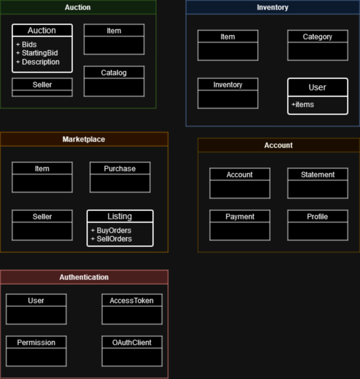

#  SwapSquare

> This project is in early development and is not ready even as an MVP

SwapSquare is a digital item exchange and PaaS, providing OAuth and inventory management, item creation and assignation as apis. It aims to improve digital item evaluation and exchange by providing a common platform for games and applications to use, as well as delegating such responsibilities of inventory systems of developers to the platform.

## Diagrams

### Bounded Contexts

